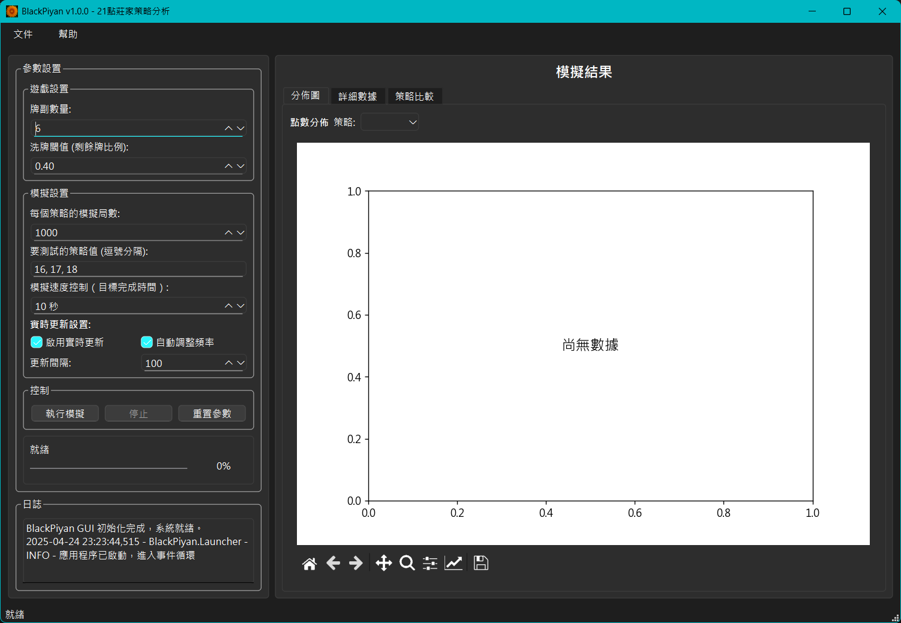
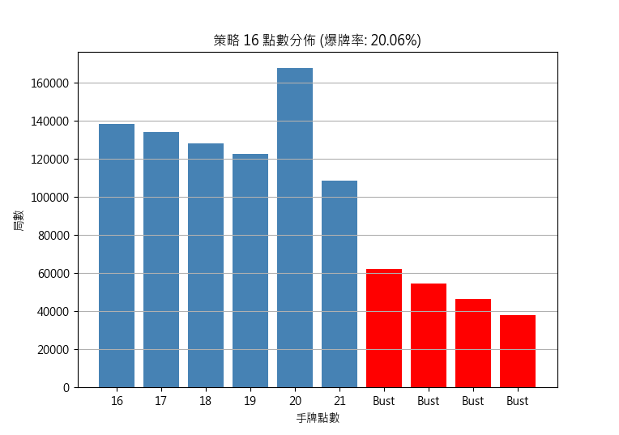
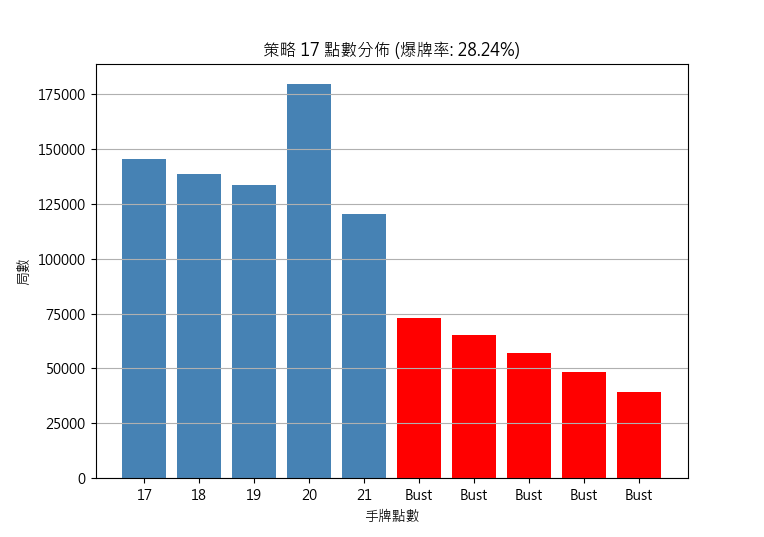
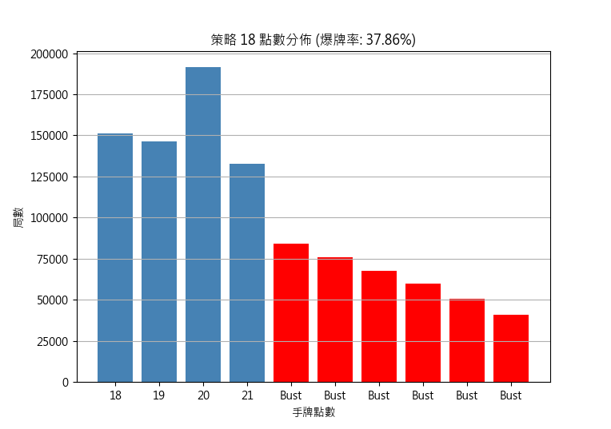
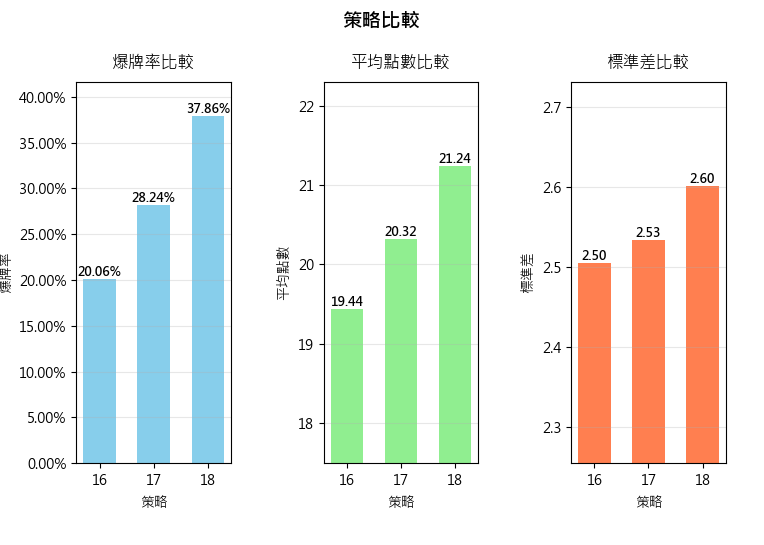

<div align="center">
  <h1>BlackPiyan</h1>
  <p>專業的21點(Blackjack)莊家策略模擬與分析工具</p>
  
  <p>
    <a href="https://www.python.org/downloads/"></a>
    <a href="./LICENSE"></a>
    <a href="https://github.com/ArIs0x145/BlackPiyan21/releases"></a>
  </p>
</div>

## 📖 專案簡介

BlackPiyan 是一個專門用於模擬和分析21點遊戲中不同莊家補牌策略的工具。通過模擬大量遊戲局數，收集和分析莊家在不同補牌策略（停牌點）下的點數分布、爆牌率等數據，幫助用戶理解不同策略的表現差異。

### 🌟 功能特點

- 🎮 模擬21點遊戲中莊家的不同補牌策略（16、17、18點等）
- 🃏 支持自定義牌副數量（預設6副牌，312張）
- 🔄 智能洗牌機制（剩餘牌數低於閾值時自動洗牌）
- 📊 生成專業的視覺化分析圖表：
  - 點數分布圖
  - 爆牌率比較
  - 平均點數比較
  - 多策略綜合比較
- 📱 完善的跨平台中文字體支持
- 🖥️ **圖形用戶界面(GUI)**：
  - 使用PySide6開發直觀易用的操作界面
  - 實時調整模擬參數
  - 交互式圖表展示
  
- ⚙️ 高度可配置的參數設置

## 🚧 未完成功能

以下功能正在開發中：
  - 模擬過程可視化
- 🔄 更多預計功能將陸續添加...

如果您有興趣參與這些功能的開發，請參考[貢獻指南](docs/contributing.md)。

## 📷 效果展示

<div align="center">
  
  <p>BlackPiyan圖形用戶界面</p>
</div>

<div align="center">
  
  
  
  
</div>

## 🚀 安裝與使用

### 環境需求

- Python 3.8 或更高版本
- 依賴庫: 見 `requirements.txt`

### 安裝依賴

```bash
pip install -r requirements.txt
```

### 運行模擬

```bash
python main.py
```

若需使用自定義配置：

```bash
python main.py --config configs/my_config.yaml
```

### 運行GUI

```bash
python run_gui.py
```

### 構建可執行檔

要將GUI打包為獨立的可執行檔案：

```bash
# 先安裝PyInstaller
pip install pyinstaller

# 運行打包腳本
python build_exe.py
```

打包後的可執行檔位於 `dist/BlackPiyan` 目錄下。

## ⚙️ 配置說明

配置文件位於 `configs/default.yaml`，可自定義以下設置：

```yaml
# 遊戲配置
game:
  decks: 6                  # 使用的牌副數量
  reshuffle_threshold: 0.4  # 當剩餘牌數低於此閾值時洗牌

# 莊家配置
dealer:
  hit_until_value: 17       # 莊家補牌策略值 (小於此值就補牌)

# 模擬配置
simulation:
  min_games_per_strategy: 1000  # 每種策略至少模擬的局數
  strategies:                   # 要測試的所有策略值
    - 16
    - 17
    - 18

# 字體配置
font:
  family: "Microsoft JhengHei"  # 中文顯示字體
  fallback: "DejaVu Sans"       # 後備字體
```

更多配置說明請參閱 [配置文檔](docs/configuration.md)。

## 📊 輸出結果

模擬結果將以兩種形式呈現：

1. 控制台和日誌文件中的統計信息
2. `results/charts/` 目錄下的圖表:  
   - 每種策略的點數分布圖  
   - 不同策略的比較圖

## 📂 專案結構

```
blackpiyan/             # 主程式碼目錄
├── analysis/           # 數據分析模塊
├── config/             # 配置管理模塊
├── game/               # 遊戲邏輯模塊
├── model/              # 數據模型
├── simulation/         # 模擬引擎
├── utils/              # 實用工具
└── visualization/      # 可視化模塊


gui/                     # GUI目錄
├── __init__.py
├── main_window.py       # 主窗口邏輯實現
├── ui_main_window.py    # 由 .ui 文件自動生成
├── main_window.ui       # Qt Designer 設計文件
├── mpl_canvas.py        # Matplotlib 嵌入控件
├── worker.py            # QThread 工作線程類
└── resources/           # 圖標等資源 
    └── icons/

configs/                # 配置文件目錄
docs/                   # 文檔目錄
results/                # 結果輸出目錄
tests/                  # 測試目錄
```

## 📚 文檔

詳細文檔請參閱 [文檔目錄](docs/README.md):

- [使用指南](docs/usage.md)
- [安裝指南](docs/installation.md)
- [API 參考](docs/api_reference.md)
- [跨平台字體支持](docs/font_support.md)
- [架構設計](docs/architecture.md)

## 🧪 運行測試

BlackPiyan 提供了完整的測試套件：

```bash
# 運行所有測試
python -m unittest discover blackpiyan.tests

# 運行特定測試模塊
python -m unittest blackpiyan.tests.test_model
python -m unittest blackpiyan.tests.test_simulation

# 運行單個測試類
python -m unittest blackpiyan.tests.test_model.TestCard
```

## 🤝 貢獻指南

歡迎任何形式的貢獻！如果您想為 BlackPiyan 做出貢獻，請參閱我們的 [貢獻指南](docs/contributing.md)。

## 📄 許可證

本項目採用 MIT 許可證 - 詳情請參閱 [LICENSE](LICENSE) 文件。

## 👥 開發團隊

BlackPiyan Team 
[ArIs0x145](https://github.com/ArIs0x145)
[love2004](https://github.com/love2004)
